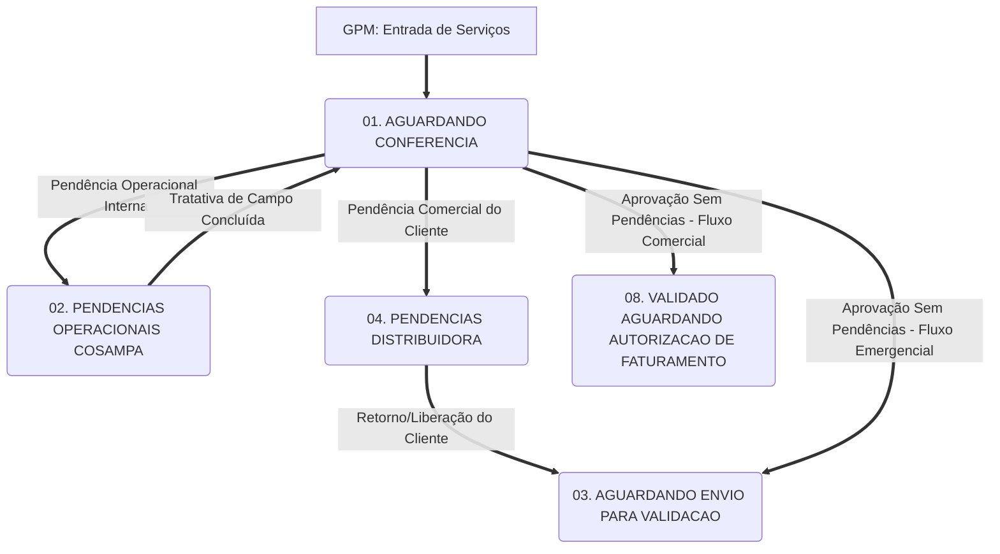
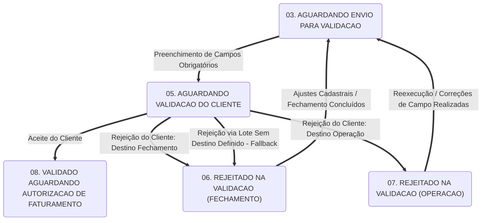

# PROTOTIPO INICIAL DA ESTEIRA

## 1. Visão Geral e Arquitetura da Solução

O sistema foi concebido como uma grande esteira operacional baseada em uma estrutura de tabela dinâmica centralizada. Nem todas as colunas são exibidas automaticamente de forma global; a visualização é composta por uma **Estrutura Padrão de Colunas Básicas** somada às colunas específicas exigidas por cada **Tela Agregadora** e seus respectivos **Status (Etapas)**.

As colunas que não pertencem ao padrão inicial continuam existindo de forma subjacente no banco de dados e são filtradas para otimizar o carregamento de cada tela. O sistema deve permitir que os usuários criem, salvem, modifiquem e disponibilizem layouts personalizados de colunas para quaisquer outros usuários da plataforma, promovendo flexibilidade no gerenciamento das visões de trabalho.

### 1.0 Regras Universais da Plataforma

*   **Auditoria Global (Log Integrado):** Qualquer alteração realizada no sistema, em qualquer campo — incluindo mudanças de status, alteração de valores de input, inclusão de anexos, justificativas ou edições de dados de campo —, **deve obrigatoriamente gerar um registro imutável de Log de Auditoria**. O log deve capturar de forma legível: data, hora, usuário logado responsável, o ID do serviço, o campo modificado, o valor anterior e o novo valor.
*   **Gestão de Pendências em Aberto (Lógica de Bloqueio):** A existência de uma pendência em aberto não gera um registro separado ou secundário a ser controlado fora da esteira operacional. O próprio serviço em si, enquanto possuir qualquer pendência em aberto, fica bloqueado pelo sistema. Nestas condições, o sistema impede qualquer avanço de fluxo normal, permitindo **exclusivamente o remanejamento para uma etapa/status de pendência** correspondente até sua integral quitação.
*   **Notificação de Transição de Responsabilidade:** Sempre que um serviço for migrado entre status diferentes que envolvam a transição de responsabilidade técnica ou financeira entre usuários de perfis distintos, o sistema deve disparar uma notificação automática (in-app ou e-mail) para o novo usuário responsável pela etapa correspondente.
*   **Sistema de Comentários e Interações (Timeline do Serviço):** Cada serviço possuirá um histórico cronológico e centralizado de interações (Timeline de Comentários). Diferente do Log de Auditoria (focado em alterações estruturais e sistêmicas), a Timeline de Comentários é voltada à colaboração humana ativa entre as equipes de Medição, Operação, Validação e Faturamento. Cada comentário inserido será associado ao usuário logado, perfil de acesso e carimbo de data/hora, tornando-se imutável após o envio. O sistema deve suportar marcações de usuários (`@usuario`) para disparar notificações em tempo real.

---

### 1.1 Estrutura Padrão da Tabela (Colunas Básicas)

A visualização base da esteira estrutura a rastreabilidade operacional estabelecendo um vínculo direto e hierárquico entre a gestão, a liderança e as equipes de campo:

#### Vínculo Estrutural de Liderança e Equipes
Para otimizar o fluxo de informações e amarrar a hierarquia de liderança diretamente à composição e atuação das equipes em campo, o fluxo de responsabilidade se dá no seguinte modelo estrutural:

$$\text{Centro de Serviço} \longrightarrow \text{Coordenador} \longrightarrow \text{Supervisor} \longrightarrow \text{Equipe} \longrightarrow \text{Membros da Equipe}$$

*   **Centro de Serviço (`centro_servico`):** A unidade organizacional mãe onde a operação está sediada.
*   **Coordenador (`Coordenador`):** Vinculado diretamente ao Centro de Serviço, atua como líder e gestor da camada de Supervisores.
*   **Supervisor (`Supervisor`):** Vinculado ao Coordenador, atua como líder direto das equipes de campo, sendo o primeiro ponto de escalonamento técnico e operacional.
*   **Equipe (`equipe`):** Agregador operacional chave vinculado diretamente ao Supervisor. É a menor unidade de controle de produtividade e execução, consolidando os recursos físicos (veículo e ferramentas) e humanos.
*   **Membros da Equipe (`membros_equipe`):** Detalhamento nominal dos colaboradores alocados na equipe no momento da execução (Encarregados, Eletricistas, Motoristas).

#### Campos de Identificação Rápida da Tabela Padrão
Sempre visíveis no grid inicial da esteira independente da tela ativa:
*   `num_servico`: Código identificador exclusivo do serviço gerado pelo sistema GPM.
*   `tdc`: Código do serviço no sistema da Distribuidora.
    *   *Regra de Interoperabilidade:* `num_servico` e `tdc` atuam de forma parecida na identificação das ordens de serviço, mas **não são intercambiáveis**. Eles possuem independência estrutural e podem transitar entre relações de cardinalidade complexas: **1 para muitos (1:N), 1 para 1 (1:1), muitos para 1 (N:1) e muitos para muitos (N:M)**. O `tdc` é utilizado de forma auxiliar para cross-reference com outros sistemas externos da distribuidora.
*   `situacao_servico`: Status de execução técnica vindo exclusivamente do sistema GPM.
    *   *Conceito Protegido de Origem:* A `situacao_servico` representa o estado do serviço no GPM e não deve ser confundida com o **SISTEMA DE ORIGEM DO SERVIÇO**. O termo **SISTEMA DE ORIGEM** é um conceito estrutural protegido que se refere estritamente à plataforma da Distribuidora na qual a modemanda comercial ou de emergência foi originalmente gerada (ex: Eorder, Synergia, SacBt).
*   `Cliente`: Identificação nominal da conta consumidora.
*   `tipo_servico`: Classificação da atividade técnica realizada.
*   `dta_exec_srv`: Data da efetiva execução do serviço em campo.

---

### 1.2 Mapeamento de Dados e Integração (GPM / Base Auxiliar)

A tabela abaixo detalha todos os campos de entrada de dados (inputs) oriundos do sistema GPM ou de bases auxiliares do contrato, incluindo as tipificações e exemplos práticos de preenchimento para garantir a padronização:

| Nome do Campo | Descrição / Regra de Negócio | Exemplo de Preenchimento |
| :--- | :--- | :--- |
| `contrato` | Identificação do contrato/departamento onde a atividade está cadastrada. | `Multiserviços Leste` |
| `origem_sistema` | Formato de geração do Serviço no GPM (PDA, Obras, Pré-Despacho ou Importação). | `Importação Massiva` |
| `num_servico` | Código identificador numérico/alfanumérico do serviço no GPM. | `364727850` |
| `Incidência` | Código da ocorrência de atendimento (essencial se não houver obra associada). | `0046897985` |
| `tipo_servico` | Classificação técnica da atividade executada (vinculada à base auxiliar). | `Manutenção Preventiva BT` |
| `situacao_servico` | Status de execução da atividade conforme registro actor do GPM. | `Executado` |
| `Id Cliente` | Código de identificação do consumidor final na Distribuidora. | `7845120` |
| `Cliente` | Nome completo do cliente associado ao ponto de entrega. | `João da Silva` |
| `Solicitante` | Nome do solicitante da atividade/serviço. | `Maria Oliveira` |
| `Bairro` | Bairro de execução da atividade. | `Centro` |
| `Localidade` | Município da execução do serviço. | `Belém` |
| `endereco` | Endereço físico completo da execução. | `Av. Presidente Vargas, 100` |
| `cod_pep_obra` | Código PEP da Obra vinculada (atua como número da ordem quando preenchido). | `716894` |
| `tipo_retorno` | Descrição do grupo macro de retornos coletados no campo. | `Produtivo` |
| `Retorno de Campo` | Código alfanumérico e descrição do retorno da execução técnica. | `200-Produtivo` |
| `Grupo Retorno de Campo` | Agrupamento lógico dos códigos de retorno de campo. | `Execução Comercial` |
| `inicio_desloc` | Data e hora de início do deslocamento da equipe para o local. | `2023-10-25 08:00:00` |
| `fim_desloc` | Data e hora de chegada ao local do serviço. | `2023-10-25 08:30:00` |
| `inicio_exec` | Data e hora de início da execução física da atividade. | `2023-10-25 08:35:00` |
| `fim_exec` | Data e hora de encerramento da atividade pela equipe. | `2023-10-25 10:00:00` |
| `cod_turno` | Código identificador da jornada/turno de trabalho no GPM. | `364621177` |
| `placa_veiculo` | Placa do veículo associado à equipe na data do serviço. | `ABC-1234` |
| `modelo_veiculo` | Descrição do modelo do veículo utilizado. | `Toyota Hilux` |
| `centro_servico` | Unidade operacional de vinculação da equipe. | `CS-BELÉM` |
| `Coordenador` | Nome do gestor responsável pelo Centro de Serviço. | `Carlos Eduardo` |
| `Supervisor` | Nome do supervisor de campo direto da equipe. | `Roberto Souza` |
| `equipe` | Identificação da equipe técnica (agregador operacional). | `EQP-TURMA-A` |
| `membros_equipe` | Nomes dos componentes da equipe alocados no serviço (apenas nomes separados por vírgulas). | `Marcos, Pedro, João` |
| `obs_servico` | Observações registradas pela equipe técnica via terminal de campo. | `Substituição de ramal concluída.` |
| `comentarios_internos` | Histórico de discussões e anotações adicionadas manualmente na esteira de validação (Timeline de Interação). | `[05/10/2023 14:00 - Carlos]: Aguardando retorno da operação sobre o croqui.` |
| `latitude_servico` | Coordenada geográfica (Y) capturada no encerramento da atividade. | `-1.455833` |
| `longitude_servico` | Coordenada geográfica (X) capturada no encerramento da atividade. | `-48.490833` |
| `dta_exec_srv` | Data calendarizada da execução do serviço. | `2023-10-25` |
| `total_servicos` | Valor monetário global do serviço executado. | `450.00` |
| `tipo_equipe` | Especialidade técnica da equipe alocada. | `Linha Viva` |
| `tipo_obra` | Segmentação técnica da obra associada. | `Ampliação de Rede` |
| `tdc` | Código auxiliar do serviço utilizado pela Distribuidora. | `889977` |

---

## 2. Estrutura das Telas e Fluxo dos Status (Cronologia Flexível)

O fluxo operacional da esteira é distribuído em **5 grandes Telas Agregadoras**, que agrupam logicamente as etapas do processo de medição, faturamento e conciliação de contratos.

> **Regra de Flexibilidade Operacional:** Embora as telas e seus respectivos status estejam ordenados numericamente de forma lógica para representar o ciclo de vida típico de um serviço, **os serviços podem ser movimentados em qualquer ordem conforme necessário pelo operador**, permitindo o fluxo não linear, retornos a etapas anteriores e repetições de subprocessos em caso de reanálises.

---

### TELA 01: MEDIÇÃO
*Perfil de Acesso Principal: Equipe de Fechamento / Analistas Financeiros*

#### `01.` AGUARDANDO CONFERENCIA
*   **Conceito:** Landing page onde todos os serviços executados e integrados do GPM entram no fluxo de faturamento do sistema.
*   **Visualização e Componentes da Interface:**
    *   Exibição do grid padrão com detalhamento imediato, ao selecionar um registro, de Atividades (Vozes de Atividades), materiais aplicados e materiais retirados.
    *   **Links Diretos (Integração):** Atalhos para abrir os módulos de *Turno*, *Serviço* e *Obra* (se aplicável) diretamente na plataforma do sistema legado GPM.
    *   **Algoritmo de Correlação de "Serviços Irmãos":** Exibe uma sublista de serviços que compartilham o mesmo espaço físico ou tempo de execução para garantir integridade analítica:
        *   *Fluxo Emergencial:* Agrupa ordens que compartilham a mesma `Incidência` e/ou pertençam ao mesmo `cod_pep_obra`.
        *   *Fluxo Comercial:* Agrupa ordens que compartilham a mesma `Incidência` e/ou pertençam ao mesmo `Id Cliente`.
*   **Ações e Regras de Transição:**
    *   *Geração de Pendência Cosampa:* O botão "Gerar Pendência Cosampa" (disponível individualmente ou para lote de registros selecionados) abre a modal de seleção dos *Itens de Correção Cosampa*. O usuário marca os desvios, adiciona os comentários explicativos na Timeline de Interação (no estado "em aberto") e envia o(s) serviço(s) para `02. PENDENCIAS OPERACIONAIS COSAMPA` (Tela 02).
    *   *Geração de Pendência Distribuidora:* O botão "Gerar Pendência Distribuidora" abre a modal correspondente de *Itens de Correção Distribuidora*. O(s) serviço(s) é(são) direcionado(s) para `04. PENDENCIAS DISTRIBUIDORA` (Tela 02).
    *   *Priorização de Direcionamento:* Caso o operador aponte simultaneamente pendências internas (Cosampa) e do cliente (Distribuidora), a **Pendência Cosampa tem prioridade de fluxo**, enviando o serviço prioritariamente para `02. PENDENCIAS OPERACIONAIS COSAMPA`.
    *   *Aprovação de Fluxo (Sem Pendências):*
        *   **Validação Obrigatória de Origem:** Antes de qualquer envio para o próximo status, o sistema exige a validação/confirmação do campo **SISTEMA DE ORIGEM DO SERVIÇO** (definindo se a ordem nasceu via Eorder/Synergia para Comercial, ou Eorder/SacBt para Emergencial). O sistema exibe o valor default já contido na tabela principal, permitindo correções em lote ou individuais.
        *   Serviços do fluxo Emergencial aprovados avançam para `03. AGUARDANDO ENVIO PARA VALIDACAO`.
        *   Serviços do fluxo Comercial aprovados avançam diretamente para `08. VALIDADO AGUARDANDO AUTORIZACAO DE FATURAMENTO` (Tela 04).

#### `03.` AGUARDANDO ENVIO PARA VALIDACAO
*   **Conceito:** Área de consolidação física das medições validadas pelo Fechamento, aguardando exportação ou transmissão para o faturamento da distribuidora.
*   **Recursos da Tela:** Ferramenta de exportação em massa de registros selecionados nos formatos XLSX e CSV (com separador por vírgula), seguindo layouts de faturamento parametrizáveis.
*   **Campos de Preenchimento Obrigatório para Avanço de Status (Transição para `05`):**
    1.  `Sistema de Faturamento` (Seleção via menu de múltipla escolha parametrizável em tabela auxiliar).
    2.  `Mês de Medição Inicial` (Input estrito no formato `MM/AAAA`).

#### `06.` REJEITADO NA VALIDACAO (FECHAMENTO)
*   **Conceito:** Serviços recusados pela Distribuidora por inconformidades cadastrais ou de faturamento, cuja correção compete diretamente ao time de Fechamento.
*   **Funcionamento:** Exibe em destaque a seção "Itens de Correção Cosampa" gerada na recusa, permitindo a edição e o saneamento dos desvios de medição.
*   **Retorno:** Após as correções necessárias, o serviço é reencaminhado para o status `03. AGUARDANDO ENVIO PARA VALIDACAO`.

#### `11.` CONCILIADO COM DIVERGENCIAS (REANALISAR)
*   **Conceito:** Serviços cujo pagamento importado divergiu do valor calculado/faturado originalmente pela Cosampa.
*   **Modificações de Interface:**
    *   Exibição destacada do campo `DIVERGÊNCIA DA CONCILIAÇÃO` (calculado e preenchido originalmente na etapa anterior).
    *   **Mudança Dinâmica de Layout:** O grid tradicional de atividades do serviço é adaptado para o formato de comparação bilateral: **Atividade Executada (Valor Realizado) vs. Atividade Paga (Valor Pago)**.
    *   Hiperlink direto para o documento de conciliação original (disponibilizado em ambiente SharePoint com estrutura de URL dinâmica).
*   **Ações:** É obrigatório o preenchimento de uma justificativa técnica de divergência através do Sistema de Comentários integrado. O sistema bloqueia a transição para outros status enquanto a justificativa estiver em branco. Se comprovada cobrança devida, avança para o status `12`.

#### `12.` CONCILIADO COM PAGAMENTO A MENOR (COBRAR DO CLIENTE)
*   **Conceito:** Casos onde a análise de divergências (`11`) constatou o direito de cobrança complementar junto ao cliente.
*   **Campos de Controle:** Exige o preenchimento do campo `Mês de Reapresentação da Medição` para controle de SLA.
*   **Transição:** Ao submeter a reapresentação, o serviço avança para `13. CONCILIADO COM PAGAMENTO A MENOR (EM DISPUTA)`, registrando automaticamente no histórico de auditoria o usuário logado ativo como o responsável definitivo pelo monitoramento desta cobrança.

#### `13.` CONCILIADO COM PAGAMENTO A MENOR (EM DISPUTA)
*   **Conceito:** Serviços em status de custódia onde as cobranças complementares reapresentadas aguardam o depósito residual ou deferimento em disputa contratual com o cliente.
*   **Ações:** Permite a transição para as etapas finais de encerramento de faturamento de acordo com a resolução da disputa financeira.

---

### TELA 02: PENDÊNCIAS
*Perfil de Acesso Principal: Operação de Campo (Supervisores, Coordenadores e Engenheiros)*

#### Regra Geral de Filtragem Hierárquica
Ao acessar a Tela de Pendências, o grid de dados é pré-filtrado de forma automática com base no login e perfil da árvore de subordinação do usuário ativo:
*   **Coordenador:** Visualiza todas as pendências das equipes e liderados diretos de seus Supervisores subordinados.
*   **Supervisor:** Visualiza exclusivamente as pendências atribuídas às suas equipes diretas em campo.
*   *Prerrogativa de Desfiltração:* Todo gestor possui o controle de limpar os filtros predefinidos do seu escopo, podendo realizar consultas gerais a serviços sob responsabilidade operacional de outros pares de coordenação ou supervisão.

#### `02.` PENDENCIAS OPERACIONAIS COSAMPA
*   **Conceito:** Direciona os serviços rejeitados pelo Fechamento que demandam intervenção ou saneamento físico e operacional na infraestrutura ou no cadastro técnico de campo.
*   **Elementos Funcionais Chave:**
    *   **Seção "Itens de Correção Cosampa":** Exibição interativa das pendências sinalizadas. Cada botão de desvio abre uma caixa de texto integrada ao Sistema de Comentários para digitação da justificativa e um botão de upload para novas mídias e fotos que comprovem a correção técnica.
    *   **Controle de Reprogramação de Equipe:** Checkbox *"Necessita Reprogramar"*. Quando marcado, o sistema exige obrigatoriamente a indicação de uma nova **Data de Programação** para retorno de campo da equipe.
    *   **Monitoramento de SLA:** Exibição lado a lado da data de execução original e da data de entrada do serviço no status de pendência, destacando os dias de atraso no saneamento do item.
*   **Transição de Retorno:** Uma vez resolvidas todas as marcações de pendência, registrados os comentários devidos e inseridos os uploads obrigatórios, o serviço retorna para `01. AGUARDANDO CONFERENCIA`.

#### `04.` PENDENCIAS DISTRIBUIDORA
*   **Conceito:** Agrupa ordens suspensas ou paralisadas por contingências e pendências administrativas ou de infraestrutura que competem estritamente às gerências do Cliente (Distribuidora).
*   **Regra de Negócio:** A interface exige o acompanhamento constante da resposta do cliente. É obrigatório o registro na Timeline de Comentários, pelo Responsável de Medição, do progresso da interação comercial e anexação de correspondências técnicas (e-mails, ofícios).
*   **Retorno:** Mediante comprovação de desbloqueio por parte do cliente, o serviço é reencaminhado para o status `03. AGUARDANDO ENVIO PARA VALIDACAO`.

#### `07.` REJEITADO NA VALIDACAO (OPERACAO)
*   **Conceito:** Serviços recusados pela auditoria técnica da Distribuidora que necessitam de intervenção corretiva de campo por parte da Operação da Cosampa.
*   **Funcionamento:** Segui exatamente o mesmo fluxo, validação hierárquica e controle do status `02. PENDENCIAS OPERACIONAIS COSAMPA` (Tratativa do bloco "Itens de Correção", inputs de comentários explicativos do supervisor na Timeline, upload obrigatório de mídias e controle de data de reprogramação).
*   **Retorno:** Saneada a rejeição operacional, o fluxo retorna para `03. AGUARDANDO ENVIO PARA VALIDACAO`.

---

### TELA 03: VALIDAÇÃO
*Perfil de Acesso Principal: Gestor de Validação / Interface com Cliente*

#### `05.` AGUARDANDO VALIDACAO DO CLIENTE
*   **Conceito:** Serviços que foram submetidos à aprovação técnica e financeira oficial da fiscalização da Distribuidora.
*   **Ações e Regras de Negócio:**
    *   *Aprovação (Fluxo de Aceite):* Ao registrar o aceite, o usuário direciona o registro para o status `VALIDADO AGUARDANDO AUTORIZACAO DE FATURAMENTO` e preenche o campo `Data da 1ª Validação`. A interface disponibiliza um botão de ação rápida para preencher o campo com a data e hora do dia corrente.
    *   *Repúdio (Fluxo de Rejeição):* Em caso de recusa técnica, o usuário preenche os "Itens de Correção Cosampa" ou "Itens de Correção Distribuidora", registrando a justificativa da inconformidade apontada pelo cliente via comentário obrigatório e fazendo a destinação do fluxo:
        *   Rejeições de caráter financeiro ou cadastral de faturamento: Avança para `06. REJEITADO NA VALIDACAO (FECHAMENTO)`.
        *   Rejeições por falha física de execução técnica: Avança para `07. REJEITADO NA VALIDACAO (OPERACAO)`.
*   **Importação de Validações em Lote (Planilha):**
    *   Permite a ingestão estruturada de planilhas contendo as respostas da fiscalização em larga escala.
    *   **Regra de Contingência de Importação (Fallback):** Caso a planilha de importação sinalize uma rejeição no serviço, mas apresente inconsistência ou omissão em relação à área de destino para correção (Fechamento ou Operação), o sistema aplicará a regra de contingência enviando o serviço por padrão para o status `06. REJEITADO NA VALIDACAO (FECHAMENTO)` a fim de que os analistas façam a triagem e o encaminhamento correto, registrando a inconsistência na Timeline.

---

### TELA 04: FATURAMENTO
*Perfil de Acesso Principal: Administrativo de Validação / Faturamento*

#### `08.` VALIDADO AGUARDANDO AUTORIZACAO DE FATURAMENTO
*   **Conceito:** Armazena os serviços que obtiveram o aceite do cliente, mas aguardam a liberação formal das autorizações de faturamento por parte da distribuidora.
*   **Funcionamento:** Os analistas de validação realizam consultas a relatórios externos de faturamento da distribuidora e preenchem/importam o campo `DATA DE VALIDAÇAO`. O campo aceita preenchimento em lote via importação de planilha de controle.
*   **Transição:** Preenchidos os dados essenciais de faturamento, o serviço avança para `09. FATURADO AGUARDANDO CONCILIAÇÃO`.

---

### TELA 05: CONCILIAÇÃO
*Perfil de Acesso Principal: Analistas Financeiros / Auditoria de Medição*

#### `09.` FATURADO AGUARDANDO CONCILIAÇÃO
*   **Conceito:** Serviços faturados consolidados, aguardando o recebimento oficial de arquivos de retorno de pagamento da distribuidora para conciliação bancária/operacional.
*   **Regra de Negócio:** Só é permitida a entrada de serviços neste status mediante o preenchimento obrigatório do campo `MÊS DE EMISSÃO`.

#### `10.` ANALISE DE CONCILIAÇÃO EM ANDAMENTO
*   **Conceito:** Status dinâmico que gerencia o processamento da importação física de planilhas padronizadas de pagamento da distribuidora (detalhando Atividades, Quantidade e Valores pagos).
*   **Regras Técnicas de Conciliação (Evento de Importação):**
    *   A importação de planilhas é tratada de forma transacional como um "Evento de Importação" integrado (que pode abranger múltiplos arquivos simultâneos).
    *   **Auditoria de Pré-Importação (Relatório ANTES):** O sistema deve gerar um snapshot completo do estado dos serviços ("Relatório ANTES") antes de aplicar os dados novos, garantindo a rastreabilidade e rollback em caso de falha de carregamento.
    *   **Extração de Amostragem do Evento:** Enquanto o evento está aberto, o usuário possui acesso a uma extração rápida focando estritamente nos dados em processamento para validação assistida com suas planilhas de faturamento.
    *   **Fechamento do Evento:** Após a importação, o operador aciona o encerramento do evento. O sistema avalia automaticamente os registros:
        *   **Serviços 100% Conciliados (Sem Divergências):** Destinados para o status final `FATURADO TOTAL (FINALIZADO)`. O registro é bloqueado contra qualquer modificação futura (exceto para usuários com privilégios master do sistema).
        *   **Serviços com Inconformidade (Divergência de Qtd ou de Valor):** Destinados ao status `11. CONCILIADO COM DIVERGENCIAS (REANALISAR)`, gerando automaticamente a diferença financeira em `DIVERGÊNCIA DA CONCILIAÇÃO` e registrando uma ocorrência de inconsistência na Timeline de Comentários do serviço.

---

## 3. Parametrização das Tabelas Auxiliares de Pendências

O backend e os componentes visuais dinâmicos (checkboxes e modais) das telas de pendência devem ser alimentados diretamente pelas seguintes tabelas de parametrização lógica administráveis:

### 3.1 Molde: Itens de Correção Cosampa
```
├── 1. Fotos
│   ├── Fotos de baixa qualidade
│   └── Sem evidência do serviço
├── 2. Materiais
│   ├── Materiais aplicados incorretamente
│   └── Materiais retirados incorretamente
└── 3. Documentação
    ├── Sem Croqui anexado
    └── Croqui incorreto
```

### 3.2 Molde: Itens de Correção Distribuidora
```
├── 1. Vozes não cadastradas no Contrato
├── 2. Serviço não despachado para Cosampa
└── 3. Ordem já faturada
```

---

## 4. Resumo Matriz de Transição de Status

### 4.1 Tabela da Matriz de Transição

Abaixo é apresentada a matriz que mapeia as transições, os respectivos gatilhos acionadores e os destinos dentro da esteira.

| Status de Origem | Condição / Ação de Gatilho | Status de Destino | Tela de Destino |
| :--- | :--- | :--- | :--- |
| **01. AGUARDANDO CONFERENCIA** | Registro de Pendência Cosampa (micro ou lote) | **02. PENDENCIAS OPERACIONAIS COSAMPA** | 02. PENDENCIAS |
| **01. AGUARDANDO CONFERENCIA** | Registro de Pendência Distribuidora (micro ou lote) | **04. PENDENCIAS DISTRIBUIDORA** | 02. PENDENCIAS |
| **01. AGUARDANDO CONFERENCIA** | Confirmação sem Pendências (Fluxo Emergencial) | **03. AGUARDANDO ENVIO PARA VALIDACAO** | 01. MEDICAO |
| **01. AGUARDANDO CONFERENCIA** | Confirmação sem Pendências (Fluxo Comercial) | **08. VALIDADO AGUARDANDO AUTORIZACAO DE FATURAMENTO**| 04. FATURAMENTO |
| **02. PENDENCIAS OPERACIONAIS**| Resolução dos itens de correção e inserção de mídias/comentários | **01. AGUARDANDO CONFERENCIA** | 01. MEDICAO |
| **03. AGUARDANDO ENVIO VALIDACAO**| Preenchimento de "Sistema Faturamento" + "Mês Medição" | **05. AGUARDANDO VALIDACAO DO CLIENTE** | 03. VALIDAÇÃO |
| **04. PENDENCIAS DISTRIBUIDORA**| Registro de parecer técnico favorável do cliente | **03. AGUARDANDO ENVIO PARA VALIDACAO** | 01. MEDICAO |
| **05. AGUARDANDO VALIDACAO CLIENTE**| Aceite do cliente registrado ou importado em lote | **08. VALIDADO AGUARDANDO AUTORIZACAO DE FATURAMENTO**| 04. FATURAMENTO |
| **05. AGUARDANDO VALIDACAO CLIENTE**| Rejeição pelo cliente com destino para Operação | **07. REJEITADO NA VALIDACAO (OPERACAO)** | 02. PENDENCIAS |
| **05. AGUARDANDO VALIDACAO CLIENTE**| Rejeição pelo cliente com destino para Fechamento | **06. REJEITADO NA VALIDACAO (FECHAMENTO)** | 01. MEDICAO |
| **05. AGUARDANDO VALIDACAO CLIENTE**| Rejeição via lote sem definição clara de destino (Fallback) | **06. REJEITADO NA VALIDACAO (FECHAMENTO)** | 01. MEDICAO |
| **06. REJEITADO VALID (FECHAMENTO)**| Tratativas de dados financeiros/cadastrais concluídas | **03. AGUARDANDO ENVIO PARA VALIDACAO** | 01. MEDICAO |
| **07. REJEITADO VALID (OPERACAO)** | Correções de campo concluídas pelo supervisor | **03. AGUARDANDO ENVIO PARA VALIDACAO** | 01. MEDICAO |
| **08. VALIDADO AGUARDANDO AUTORIZACAO**| Preenchimento da Data de Validação do Cliente | **09. FATURADO AGUARDANDO CONCILIAÇÃO** | 05. CONCILIACAO |
| **09. FATURADO AGUARDANDO CONCILIAÇÃO**| Preenchimento do Mês de Emissão | **10. ANALISE DE CONCILIAÇÃO EM ANDAMENTO**| 05. CONCILIACAO |
| **10. ANALISE DE CONCILIAÇÃO** | Evento fechado - Sem divergências financeiras | **FATURADO TOTAL (FINALIZADO)** | 05. CONCILIACAO |
| **10. ANALISE DE CONCILIAÇÃO** | Evento fechado - Com divergências de valores/quantidades | **11. CONCILIADO COM DIVERGENCIAS (REANALISAR)**| 01. MEDICAO |
| **11. CONCILIADO C/ DIVERGÊNCIA**  | Validação de cobrança complementar ao cliente (justificativa na Timeline) | **12. CONCILIADO C/ PAGTO MENOR (COBRAR)** | 01. MEDICAO |
| **12. CONCILIADO PAGTO (COBRAR)**  | Preenchimento do campo "Mês Reapresentação" | **13. CONCILIADO C/ PAGTO MENOR (EM DISPUTA)**| 01. MEDICAO |
| **13. CONCILIADO PAGTO (EM DISPUTA)**| Parecer final da Distribuidora sobre a disputa | **Etapas de Finalização do Fluxo** | Conforme Resolução |

---

### 4.2 Fluxogramas das Transições de Status

#### Fluxograma de Entrada, Conferência e Saneamento de Pendências (Fase Inicial)



##### Comentários Técnicos e Analíticos de Negócio (Fluxo Inicial):
*   **Regra de Precedência de Pendências:** Caso o usuário aponte simultaneamente desvios internos (Cosampa) e externos (Distribuidora), a transição para o status `02. PENDENCIAS OPERACIONAIS COSAMPA` é prioritária. O bloqueio de fluxo impede qualquer avanço de etapa até que o status seja alterado de volta para `01`.
*   **Gestão de Retornos de Pendência:** A transição de retorno do status `02` para o status `01` exige, programaticamente, a gravação de um comentário explicativo do supervisor na Timeline e o upload de mídias de comprovação na seção de itens de correção.
*   **Independência de Fluxo (Comercial vs. Emergencial):** O fluxo comercial possui aceitação acelerada, enviando o serviço aprovado sem pendências diretamente para o faturamento (status `08`), enquanto o emergencial passa pela etapa preparatória de envio para validação física (status `03`).

---

#### Fluxograma de Envio, Validação do Cliente e Tratamento de Recusas (Fase Final)



##### Comentários Técnicos e Analíticos de Negócio (Fluxo de Validação e Recusas):
*   **Condições de Contorno Obrigatórias:** A transição do status `03` para o `05` exige obrigatoriamente que o sistema valide o preenchimento de `Sistema de Faturamento` e `Mês de Medição Inicial` para evitar a ausência de parâmetros fiscais na exportação da planilha.
*   **Mecanismo Automatizado de Fallback (Lote):** O upload de planilhas de retorno do cliente pode conter inconsistências estruturais. Caso o processador de lote encontre uma rejeição sem o mapeamento exato da área responsável (Operação vs. Fechamento), o sistema direciona compulsoriamente o serviço para o status `06. REJEITADO NA VALIDACAO (FECHAMENTO)`, gerando um alerta visual e salvando uma linha de Log de Inconsistência na Timeline de Comentários do registro afetado.
*   **Acoplamento de Histórico (Timeline e Log de Auditoria):** Todo retorno de rejeição (`06` e `07`) limpa o campo de aprovação anterior, porém retém permanentemente o registro de auditoria imutável do log original, incluindo a assinatura digital do fiscal da Distribuidora que executou a ação no portal/planilha de integração.

---

## 5. Critérios de Aceite e Requisitos Técnicos

Para assegurar a qualidade e a integridade da plataforma da esteira de serviços, os seguintes requisitos de arquitetura de dados e de sistema devem ser estritamente seguidos:

### 5.1 Requisitos de Performance e Interface (UI/UX)
*   **Paginação e Lazy Loading:** O componente do grid dinâmico principal deve ser capaz de carregar e processar bases massivas com centenas de milhares de linhas ativas provenientes do GPM sem degradação da experiência de navegação ou latência de carregamento. Utilizar técnicas de paginação server-side e rendering dinâmico de elementos visuais.
*   **Persistência da Sessão:** O sistema de front-end deve reter os parâmetros aplicados pelos usuários (ordenações de coluna, largura das colunas, agrupamentos de filtro e paginação corrente) ao navegar entre telas ou ao atualizar a janela do navegador, garantindo ergonomia ao operador.

### 5.2 Segurança, Permissão e Acessibilidade (Hierarquia de Dados)
*   **Restrição Estrita de Acesso Baseada em Perfis (RBAC):** Os níveis de acesso e capacidades transacionais do sistema devem ser segregados com base nos perfis logados. A navegação de supervisores deve ser estritamente voltada às telas operacionais de pendência, limitando as transições de faturamento e faturamento complementar aos perfis gerenciais e de fechamento financeiro.
*   **Imutabilidade de Histórico de Auditoria e Timeline:** O sistema não deve permitir exclusão ou deleção lógica de logs de auditoria, históricos de transições e comentários de discussão no banco de dados. Os status históricos e comentários enviados nos serviços nunca deverão ser limpos, agindo como registros de integridade operacional do contrato.

### 5.3 Lógica de Negócio e Validações de Sistema
*   **Bloqueios em Lote de Transições Incompletas:** Sempre que um operador disparar ações coletivas ou processamentos em lote na esteira operacional, o mecanismo de validação de dados deverá avaliar individualmente a conformidade de preenchimento obrigatório de cada linha (incluindo a obrigatoriedade de comentários/justificativas onde aplicável). Caso haja qualquer registro inválido por pendências técnicas ou ausência de informações, o lote total não deve falhar. O sistema deve reter especificamente o registro inconsistente, exibindo uma tela de sumário com os erros identificados e persistindo no fluxo de alteração todos os demais registros regulares.